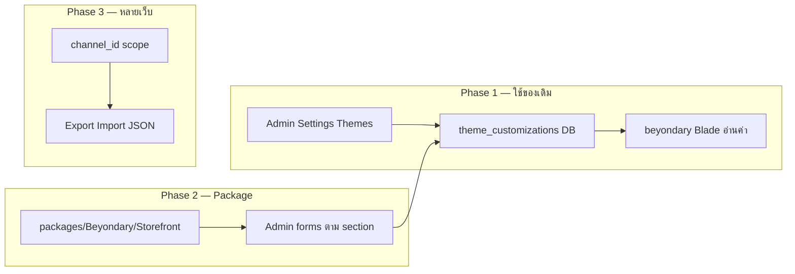

# Beyondary Storefront Theme — คู่มือปรับแต่งหน้าบ้าน

> Theme code: `beyondary` (child ของ `default`)  
> ดัชนี: [docs/README.md](../README.md) · Mockup: [docs/mockup/thai_handmade_global_store.html](../mockup/thai_handmade_global_store.html)  
> Cursor rules: `.cursor/rules/theme.mdc` · Inventory: [customizations.md](customizations.md)

เอกสารนี้สรุปวิธีปรับ **เมนู, Hero, Slider, Footer** และ section อื่นบนหน้าร้าน หลังจากตั้ง Channel → Design → Theme เป็น `beyondary` แล้ว

---

## 1. สถานะปัจจุบัน

Theme `beyondary` ใช้ **layout ตาม mockup** แทน loop Theme Customization แบบ theme `default` บนหน้าแรก

| ส่วน | ไฟล์หลัก | วิธีทำงานตอนนี้ |
|------|----------|------------------|
| Announcement + Header / Menu | `views/components/layouts/header/index.blade.php` | ลิงก์คงที่ + ข้อความจาก lang |
| Hero | `views/home/partials/hero.blade.php` | แบนเนอร์รูปเดียว + ปุ่ม CTA |
| Trust badges | `views/home/partials/trust-badges.blade.php` | ข้อความจาก lang |
| หมวดหมู่ | `views/home/partials/categories.blade.php` | Category tree จาก Catalog |
| สินค้าแนะนำ | `views/home/partials/featured-products.blade.php` | Product API (`shop.api.products.index`) |
| Our Story | `views/home/partials/our-story.blade.php` | ข้อความจาก lang |
| Newsletter | `views/home/partials/newsletter.blade.php` | Bagisto subscription route |
| Footer | `views/components/layouts/footer/index.blade.php` | หมวดหมู่จาก DB + Footer Links จาก Admin (ถ้ามี) + lang |

หน้าแรกรวม section ใน `views/home/index.blade.php`:

```blade
@include('shop::home.partials.hero')
@include('shop::home.partials.trust-badges')
@include('shop::home.partials.categories')
@include('shop::home.partials.featured-products')
@include('shop::home.partials.our-story')
@include('shop::home.partials.newsletter')
```

> **หมายเหตุ:** Theme `default` ใช้ `@foreach ($customizations as $customization)` จาก Admin → Settings → Themes. Theme `beyondary` **override** หน้าแรกแล้ว — การตั้งค่า Image/Product Carousel ใน Admin **จะไม่แสดงบนหน้าแรก** ยกเว้น **Footer Links** ที่ footer ดึงจาก DB อยู่แล้ว

---

## 2. เปิดใช้ Theme

1. Admin → **Settings** → **Channels** → แก้ Channel ที่ใช้งาน
2. แท็บ **Design** → **Theme** = `beyondary`
3. บันทึก แล้วเปิด storefront ตรวจสอบ

ค่า default ใน `config/themes.php`:

```php
'default' => 'beyondary',  // หรือตั้งผ่าน Channel ใน Admin
```

---

## 3. โครงสร้างไฟล์ที่ต้องรู้

| ประเภท | Path |
|--------|------|
| Blade overrides | `resources/themes/beyondary/views/` |
| ภาษา (TH/EN) | `resources/lang/th/beyondary.php`, `resources/lang/en/beyondary.php` |
| Vite / Tailwind source | `resources/themes/beyondary/` (`vite.config.js`, `assets/`) |
| Build output (JS/CSS) | `public/themes/shop/beyondary/build/` |
| รูป static | `public/themes/shop/beyondary/images/` |
| Mockup อ้างอิง | `docs/mockup/thai_handmade_global_store.html` |
| Theme config | `config/themes.php`, `config/bagisto-vite.php` |

**ห้ามแก้** `packages/Webkul/Shop/src/Resources/views/` โดยตรง — ใช้ child theme + `parent => 'default'`

---

## 4. สองแนวทางในการปรับแต่ง

### แนวทาง A — แก้ใน Theme (แนะนำสำหรับ Beyondary)

เหมาะเมื่อต้องการ UI ตาม mockup พรีเมียม ควบคุม layout ได้เต็มที่

```
docs/mockup/thai_handmade_global_store.html   ← อ้างอิงดีไซน์
resources/themes/beyondary/views/             ← Blade / HTML
resources/lang/{th,en}/beyondary.php          ← ข้อความ
public/themes/shop/beyondary/images/          ← รูป
```

หลังแก้ CSS/JS:

```bash
cd resources/themes/beyondary
npm run build
```

### แนวทาง B — จัดการผ่าน Admin (ไม่ต้องแก้โค้ด)

**Admin → Settings → Themes**

| ประเภทใน Admin | ใช้กับ |
|----------------|--------|
| Image Carousel | Slider รูป (theme default เท่านั้น — beyondary ยังไม่ดึงบนหน้าแรก) |
| Product Carousel | สินค้าแนะนำ |
| Category Carousel | หมวดหมู่ |
| Static Content | HTML/CSS block |
| Footer Links | ลิงก์ footer (**ใช้ได้กับ beyondary**) |
| Services Content | Trust badges แบบไอคอน |

ข้อมูล Catalog (หมวดหมู่, สินค้า, รูปสินค้า) จัดการที่ **Catalog** ใน Admin ตามปกติ

---

## 5. แนวทาง Hybrid (แนะนำ)

| จัดใน Theme (โค้ด) | จัดใน Admin / DB |
|--------------------|------------------|
| Layout Header, Hero, Trust, Our Story | หมวดหมู่, สินค้า, ราคา, สต็อก |
| สี / ฟอนต์ / spacing ตาม mockup | Footer Links (Settings → Themes) |
| Product card, carousel component | CMS Pages (FAQ, Shipping, Terms) |
| ข้อความคงที่ (ผ่าน lang files) | Channel logo, favicon (Channel settings) |

---

## 6. ปรับทีละส่วน

### 6.1 เมนู (Menu / Navigation)

**ไฟล์:** `views/components/layouts/header/index.blade.php` (desktop + `#beyondary-mobile-menu`)

**ตอนนี้:** ลิงก์ Home / Shop / Categories / Story / Contact แบบคงที่

| อยากเปลี่ยน | ทำที่ |
|------------|-------|
| ข้อความเมนู | `resources/lang/th/beyondary.php` → `nav.*` |
| ลิงก์ anchor (#categories, #artisans) | แก้ `href` ใน header blade |
| เมนูจากหมวดหมู่จริง | loop `$categoryRepository->getVisibleCategoryTree($channel->root_category_id)` |

ตัวอย่างเมนู dynamic:

```blade
@foreach ($rootCategories as $category)
    <a href="{{ $category->url }}" class="hover:text-brand-gold transition">
        {{ $category->name }}
    </a>
@endforeach
```

### 6.2 Hero

**ไฟล์:** `views/home/partials/hero.blade.php`

| อยากเปลี่ยน | ทำที่ |
|------------|-------|
| รูปพื้นหลัง | แทน `public/themes/shop/beyondary/images/hero.jpg` |
| หัวข้อ / ปุ่ม | `beyondary.php` → `hero.tagline`, `hero.title`, `hero.cta_*` |
| Layout / overlay | แก้ Tailwind class ใน blade ตาม mockup |

### 6.3 Slider (หลายสไลด์)

**ตอนนี้:** Hero เป็นแบนเนอร์เดียว ไม่มี carousel

**ทางเลือก:**

1. **Slider ใน theme** — สร้าง `home/partials/hero-slider.blade.php` ใช้ `<x-shop::carousel>` หรือ library ใน theme; รูปจาก config/lang หรือดึง Theme Customization ใน Blade
2. **Admin Image Carousel** — แก้ `home/index.blade.php` ให้รองรับ `$customizations` บางส่วน (carousel ด้านบน + partials ด้านล่าง)

Component carousel ที่มีใน theme: `views/components/products/carousel.blade.php` (สินค้า — มี styling Beyondary แล้ว)

### 6.4 Trust Badges

**ไฟล์:** `views/home/partials/trust-badges.blade.php`  
**ข้อความ:** `beyondary.trust.*` ใน lang files

### 6.5 หมวดหมู่ + สินค้าแนะนำ

| Section | ไฟล์ | ข้อมูลมาจาก |
|---------|------|------------|
| Categories grid | `categories.blade.php` | Admin → Catalog → Categories |
| Featured products | `featured-products.blade.php` | API `limit=8&sort=created_at-desc` |

ปรับจำนวนสินค้า / filter ได้ใน `featured-products.blade.php` ที่พารามิเตอร์ `:src` ของ `<x-shop::products.carousel>`

### 6.6 Our Story + Newsletter

| Section | ไฟล์ | ข้อความ |
|---------|------|--------|
| Our Story | `our-story.blade.php` | `beyondary.story.*` |
| Newsletter | `newsletter.blade.php` | `beyondary.newsletter.*` |

### 6.7 Footer

**ไฟล์:** `views/components/layouts/footer/index.blade.php`

| อยากเปลี่ยน | ทำที่ |
|------------|-------|
| ลิงก์ Help / FAQ / Policy | Admin → **Settings → Themes** → Footer Links (theme = `beyondary`) |
| หมวดหมู่ใน footer | มาจาก Catalog อัตโนมัติ (root categories) |
| ข้อความ About | `beyondary.footer.*` |
| Social icons | แก้ `href` ใน footer blade |
| โลโก้ | Channel logo หรือ `public/themes/shop/beyondary/images/logo.png` |

---

## 7. แผนดำเนินงานแนะนำ

### Phase 1 — เนื้อหา (ไม่ต้องเขียนโค้ดมาก)

- [ ] อัปโหลด `logo.png`, `hero.jpg` → `public/themes/shop/beyondary/images/`
- [ ] แก้ข้อความใน `resources/lang/th/beyondary.php` (และ `en` ถ้าต้องการ)
- [ ] สร้างหมวดหมู่ + สินค้าใน Admin → Catalog
- [ ] ตั้ง Footer Links ใน Admin → Settings → Themes
- [ ] ตั้ง Channel logo / SEO ใน Channel settings

### Phase 2 — ดีไซน์ตาม mockup

- [ ] เปิด `docs/mockup/thai_handmade_global_store.html` เทียบทีละ section
- [ ] ปรับ partials ใน `views/home/partials/` และ header/footer
- [ ] `npm run build` ใน `resources/themes/beyondary/`
- [ ] Hard refresh หน้าร้าน (Ctrl+Shift+R)

### Phase 3 — Dynamic (ถ้าต้องการ)

- [ ] เมนูจากหมวดหมู่จริง
- [ ] Hero เป็น slider หลายรูป
- [ ] (ทางเลือก) ผสม Theme Customization จาก Admin กับหน้าแรก beyondary

---

## 8. กฎและข้อควรระวัง

1. **อ้างอิง mockup ก่อนแก้ UI** — ดู `.cursor/rules/theme.mdc` section 0
2. **Asset ใน Blade:** ใช้ `bagisto_asset('images/...', 'shop')` หรือ `asset('themes/shop/beyondary/images/...')` — namespace `'shop'` สำคัญสำหรับ `bagisto_asset`
3. **Vue ใน Blade:** ห้ามใช้ `:key="product.id"` ใน template ที่ Blade parse — ใช้แบบ default Bagisto หรือ escape ให้ถูกต้อง
4. **Localization:** ข้อความภาษาไทย/อังกฤษ ใส่ใน `__('beyondary....')` / `@lang('beyondary....')`
5. **Build:** แก้ `assets/css` หรือ `assets/js` แล้วต้อง `npm run build` ก่อน deploy
6. **Performance:** รูป hero/slider ควร optimize (WebP, ขนาดพอเหมาะ) — ดู [performance-analysis.md](../performance-analysis.md)

---

## 9. คำสั่งที่ใช้บ่อย

```bash
# Build storefront theme
cd resources/themes/beyondary
npm run build

# Clear view cache หลังแก้ Blade
php artisan view:clear

# Dev server (hot reload) — ถ้าใช้ Vite dev
cd resources/themes/beyondary
npm run dev
```

---

## 10. ไฟล์ Blade ทั้งหมดใน theme (ณ ปัจจุบัน)

```
resources/themes/beyondary/views/
├── home/
│   ├── index.blade.php
│   └── partials/
│       ├── hero.blade.php
│       ├── trust-badges.blade.php
│       ├── categories.blade.php
│       ├── featured-products.blade.php
│       ├── our-story.blade.php
│       └── newsletter.blade.php
├── components/
│   ├── layouts/
│   │   ├── index.blade.php
│   │   ├── header/index.blade.php
│   │   ├── header/locale-currency-dropdown.blade.php
│   │   ├── footer/index.blade.php
│   │   └── partials/logo.blade.php
│   └── products/
│       ├── card.blade.php
│       └── carousel.blade.php
└── checkout/cart/mini-cart.blade.php
```

หน้าอื่นที่ยังไม่ override จะ fallback ไป theme `default` ผ่าน `parent => 'default'`

---

## 11. Admin UI สำหรับแก้ Theme (แผน Upgrade-Safe)

### 11.1 คำตอบสั้น: ต้องสร้างเมนูใหม่ไหม?

**Phase แรก — ไม่ต้อง** ใช้เมนูที่ Bagisto มีอยู่แล้ว:

**Admin → Settings → Themes** (`admin.settings.themes.index`)

รองรับ Image Carousel, Product/Category Carousel, Static Content, Footer Links, Services Content — เก็บใน `theme_customizations` แยกตาม `channel_id` + `theme_code`

ปัญหาปัจจุบันของโปรเจกต์: theme `beyondary` **override หน้าแรก** เป็น partials คงที่ จึง**ยังไม่อ่าน** block จาก Themes ยกเว้น Footer Links บางส่วน

งานที่ต้องทำจริงคือ **เชื่อม UI ที่มีอยู่กับ Blade ของ beyondary** ไม่ใช่สร้างเมนูซ้ำ

**เมนูใหม่** ควรทำเมื่อต้องการ UX ชุดใหม่จริงๆ เช่น “Beyondary Storefront” แบบ section builder / live preview — วางใน **custom package** (Layer 4) ไม่แก้ `packages/Webkul/Admin/`

---

### 11.2 ชั้นที่ปลอดภัยต่อการอัปเกรด Bagisto

| Layer | ใช้ทำอะไร | หลัง `composer update` |
|-------|-----------|------------------------|
| **1 Theme** | Blade อ่านค่าจาก DB/config แล้ว render UI beyondary | ไม่หาย |
| **2 Config/Lang** | ค่า default, fallback ข้อความ | ไม่หาย |
| **3 Migration** | ตารางใหม่ (ถ้าต้อง schema เกิน `theme_customizations`) | รัน `migrate` ต่อ |
| **4 Package** | Admin UI, routes, menu, repository, API | ไม่หาย — **แนะนำสำหรับ feature ใหม่** |
| **5 Core patch** | แก้ `packages/Webkul/*` | **เสี่ยง — ห้าม** |

อ้างอิง: [customizations.md](customizations.md), `.cursor/rules/bagisto-customization.mdc`

---

### 11.3 แนวทางที่แนะนำ (3 Phase)



#### Phase 1 — Wire-up (เร็ว, ไม่สร้างเมนู) ✅ ทำแล้ว

1. แก้ `home/index.blade.php` + partials ให้ดึงค่าจาก `ThemeCustomizationRepository` (เหมือน default แต่ใช้ layout beyondary)
2. แมป type → partial:
   - `image_carousel` → hero/slider component สไตล์ beyondary
   - `static_content` → Our Story / announcement
   - `product_carousel` / `category_carousel` → carousel ที่มีอยู่
   - `footer_links` → footer (ทำบางส่วนแล้ว)
   - `services_content` → trust badges
3. คง **โครง HTML/Tailwind ใน theme** — Admin แก้ได้แค่เนื้อหา/รูป/ลิงก์ ไม่ใช่ layout ทั้งหน้า

ผล: ลูกค้า/ทีมแก้ slider, footer ผ่าน **Settings → Themes** ได้ทันที

**ไฟล์ที่ implement แล้ว (2026-06-08):**

| ไฟล์ | หน้าที่ |
|------|--------|
| `resources/themes/beyondary/views/home/index.blade.php` | loop `$customizations` + fallback mockup |
| `views/components/carousel/hero.blade.php` | hero/slider จาก Admin `image_carousel` |
| `views/home/partials/trust-badges.blade.php` | `services_content` |
| `views/home/partials/categories.blade.php` | `category_carousel` (+ `$title`) |
| `views/home/partials/product-carousel-section.blade.php` | `product_carousel` |
| `views/home/partials/static-content.blade.php` | `static_content` HTML/CSS |
| `database/migrations/2026_06_08_000003_*` + `000004_*` | sync `theme_code` → `beyondary` สำหรับ channel ที่ใช้ theme นี้ |

**ทดสอบ:** Admin → **Settings → Themes** แก้ Image Carousel / Services / Static Content แล้วรีเฟรชหน้าแรก — ถ้ายังไม่มี block ใดเลย จะเห็น layout mockup เดิม (fallback)

#### Phase 2 — `packages/Beyondary/Storefront` ✅ MVP ทำแล้ว

สร้าง package แยก (เหมือน `Beyondary/Performance`):

```
packages/Beyondary/Storefront/
├── src/
│   ├── Providers/StorefrontServiceProvider.php
│   ├── Http/Controllers/Admin/...
│   ├── Repositories/ (หรือ wrap ThemeCustomizationRepository)
│   └── Config/menu.php, acl.php
├── resources/views/admin/...     ← หรือ override ใน beyondary-admin
└── database/migrations/          ← ถ้าต้องตาราง beyondary_sections
```

- ลงทะเบียนใน `bootstrap/providers.php`
- เมนูใหม่ (ถ้าต้องการ): เช่น **Beyondary → หน้าร้าน** — merge config จาก package ไม่แก้ core Admin
- ฟอร์มแยกตาม section: Hero, Announcement, Trust, Menu links, Social

**ที่ implement แล้ว (MVP):**

| รายการ | Path / route |
|--------|----------------|
| Package | `packages/Beyondary/Storefront/` |
| เมนู Admin | **Beyondary → หน้าร้าน** |
| Dashboard | `admin/beyondary/storefront` — แสดง section หน้าแรก + ลิงก์ไป Settings → Themes แก้เนื้อหา |
| Migration homepage | `2026_06_08_000005_*` — เพิ่ม category/product carousel, ปิด static offer เดิม |

**Phase 2 เต็ม (ทำแล้ว):**

| รายการ | รายละเอียด |
|--------|-------------|
| ฟอร์มแก้ section | `admin/beyondary/storefront/sections/{hero\|trust\|categories\|products\|our_story}/edit` |
| Our Story preset | migration `2026_06_08_000006_*` + ฟอร์ม structured |
| Export / Import | ปุ่มใน dashboard + `php artisan beyondary:storefront:export` / `import` |

#### Phase 3 — ใช้กับเว็บอื่น ✅ ทำแล้ว

ข้อมูล **scope ตาม Channel** (`channel_id`, `theme_code`)

| รายการ | รายละเอียด |
|--------|-------------|
| Export ZIP (v2) | `manifest.json` + `assets/theme/{id}/*` — ย้ายรูป slider/story ข้าม instance ได้ |
| Export JSON (v1) | เนื้อหาเท่านั้น (ไม่มีไฟล์รูป) |
| Import | รองรับ ZIP/JSON + remap path รูปไป `theme/{newId}/` |
| Built-in preset | ปุ่ม **ติดตั้ง preset** ใน Admin หรือ `php artisan beyondary:storefront:install-preset` |
| Service | `packages/Beyondary/Storefront/src/Services/StorefrontTransferService.php` |

**CLI ย้ายไปอีกเซิร์ฟเวอร์:**

```bash
php artisan beyondary:storefront:export --channel=default --format=zip
php artisan beyondary:storefront:import /path/to/beyondary-storefront-default-*.zip --channel=default
```

Deploy ชุดเดียวกัน: theme `beyondary` + package `Beyondary/Storefront` + ไฟล์ ZIP export

---

### 11.4 สิ่งที่ไม่ควรทำ

| อย่าทำ | ทำแทน |
|--------|--------|
| แก้ `ThemeController` ใน `packages/Webkul/Admin` | Controller ใหม่ใน `Beyondary/Storefront` + route ของ package |
| แก้ model `ThemeCustomization` ใน core | ตารางใหม่ `beyondary_theme_sections` หรือเก็บ JSON ใน options ที่มีอยู่ |
| สร้างเมนูซ้ำ “Themes” | ขยาย **Settings → Themes** หรือเมนู **Beyondary** ชัดเจนคนละชั้น |
| ให้ Admin แก้ Tailwind/class โดยตรง | แก้ได้เฉพาะ field ที่กำหนด (ข้อความ, รูป, URL, เปิด/ปิด section) — layout ล็อกใน theme |

---

### 11.5 สรุปการตัดสินใจ

| เป้าหมาย | แนะนำ |
|----------|--------|
| แก้ hero/slider/footer จาก Admin เร็วๆ | Phase 1 — wire `theme_customizations` เข้า beyondary Blade |
| UI สวย แยก section ชัด ไม่ยุ่งกับ Themes เดิม | Phase 2 — เมนู **Beyondary → หน้าร้าน** ใน custom package |
| เอาไปใช้หลายเว็บ | Channel-scoped data + export/import; theme + package deploy ชุดเดียวกัน |
| อัปเกรด Bagisto แล้วไม่หาย | ทุกอย่างใน Layer 1 + 4 เท่านั้น; บันทึกใน [customizations.md](customizations.md) |

---

## 12. เอกสารที่เกี่ยวข้อง

| เอกสาร | เนื้อหา |
|--------|---------|
| [customizations.md](customizations.md) | Layer 1 theme + upgrade inventory |
| [admin-theme-plan.md](admin-theme-plan.md) | หลังบ้าน beyondary-admin |
| [performance-analysis.md](../performance-analysis.md) | FPC, frontend bundle, Redis |
| `.cursor/rules/theme.mdc` | Design tokens, component mapping |

---

*อัปเดต: มิถุนายน 2026 — รวมแผน Admin Theme Editor (upgrade-safe)*
